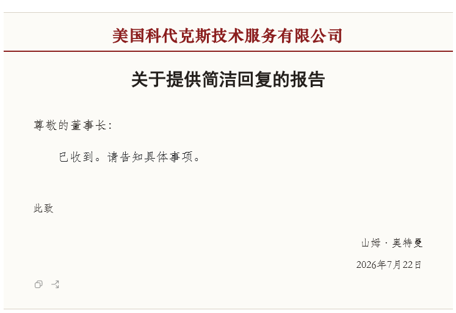
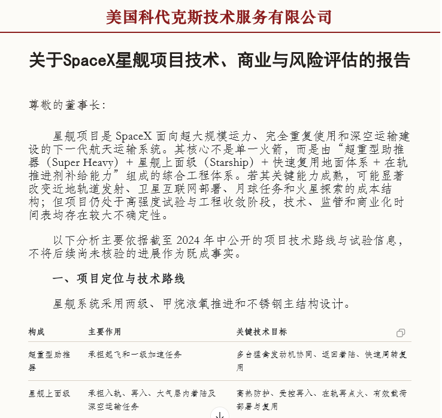
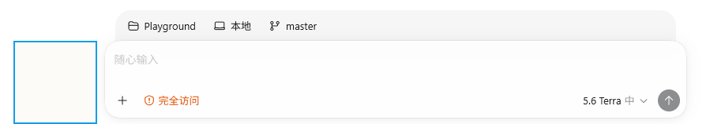

<h1 align="center">Codex 公文模式</h1>

---

  
<strong>Codex呈递公文并接受批示圈阅。</strong>

  
为 Codex 桌面端提供公文式回复、正式文风与圈阅反馈。

  
本机 CDP 注入，不改官方安装包。非 OpenAI 官方产品。

  
不修改 <code>.app</code>、<code>app.asar</code> 或 <code>WindowsApps</code>。

> [!IMPORTANT]
> 该工具仅供娱乐与学习交流之用，请在合理、合法的范围内使用。 
> 该工具本身无法在不修改代码的前提下伪造真实文件或在机构签发的文件。 
> 因对该工具的不合理使用而产生的任何直接或间接责任、损失或纠纷，使用者自行承担。 
> 他人对该仓库代码作出的任何改动、由此产生的风险或后果均与该仓库所有者无关。

## 概述

公文格式是组织、公司、机构等集体以正式、清晰方式书面沟通、“文来文往”的重要工具。

通过公文的形式操作Codex，既提供了新式的Vibe体验，又强制LLM在通盘思考后，尽量清晰、正式、明确的表达观点和意见。

## 功能介绍

### 1. 回复变成公文格式

视觉呈现仅修改回复侧，不会改变用户消息的显示方式。

每条回复会显示题头、称谓、标题、正文与落款，并从回复中的结构化标题信息生成公文式标题。

流式生成期间会保持落款区域稳定，完成后再补齐结束语、署名和日期。代码块、命令、表格等原有 Markdown 内容仍按其原格式呈现。

  

### 2. 遣词酌句向正式公文文风靠拢

本模式会在发送时临时附加文风约束，提示 LLM 给出符合公文文风的回复；发送后会恢复原始输入。

本模式引导回复采用准确、简明、克制的书面表达，并按事项组织层次；在组织文字时，侧重于使用专业、书面、官方的语言和文字。

不同文种会采用相应的收束表达。例如，请示通常以“妥否，请批示”征询意见，报告以“特此报告”陈述事项，函以“特此函告”沟通事宜，批复则以“此复”作答。具体措辞仍会结合当前任务和上下文组织，并非固定套用。

该约束不改变用户提供的事实、立场、选材或任务，也不改写代码、命令、日志、表格、JSON 和用户指定的输出格式。

  

### 3. 圈阅表达同意和不同意

为尽可能优化用户体验，在原有 Codex 输入区域左侧加入独立的正方形圈阅区域。

画圈表示同意，画叉表示不同意；高置信识别结果会以 `【反馈：同意】` 或 `【反馈：不同意】` 的可编辑文字写入当前输入框。

开始圈阅时草稿为空，且原生发送按钮可用时，识别成功后会自动发送一次；已有草稿时只追加反馈，仍由用户决定何时发送。

鼠标悬浮到圈阅区域时会显示画笔，按住鼠标拖动即可绘制圈或叉。

  

  <table align="center">
    <tr>
      <td align="center"></td>
      <td align="center"></td>
    </tr>
    <tr>
      <td align="center">同意</td>
      <td align="center">不同意</td>
    </tr>
  </table>

## 安装与使用

请根据所用系统完成安装。Windows 用户建议先运行本机预检；它只检查本工具所需环境，不会安装、下载或配置 Codex。预检通过后完成安装，并从 `Codex Dream Skin` 启动入口打开 Codex，即可正常开始对话；助手回复会自动以公文格式呈现。

需要对当前内容给出反馈时，可在输入框左侧的圈阅区域画圈表示同意，画叉表示不同意。

具体安装、预检和使用说明见 [Windows 文档](./windows/README.md) 与
[macOS 文档](./macos/README.md)。

## 备注

- Windows 和 macOS 均提供 CODEX Document Mode；macOS 的自动化 fixture 已覆盖，
  但仍需要真实 Mac 上的官方 Codex Desktop 完成最终实机验收。
- 欢迎就公文的具体书写策略和文字提出建议

## 致谢

- [Codex-Dream-Skin](https://github.com/Fei-Away/Codex-Dream-Skin/tree/main) - 提供Codex皮肤功能基建
- [Naptie/endfield-docmaker](https://github.com/Naptie/endfield-docmaker) - 灵感和公文格式来源
